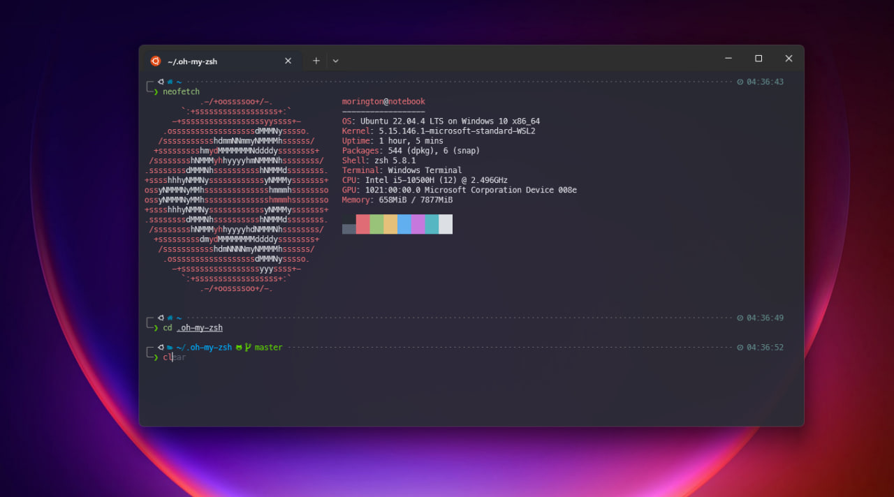

# Установка и настройка Oh-my-zsh

### Устанавливаем zsh

Cкачиваем и устанавливаем

```
sudo apt -y install zsh 
```

Устанавливаем по умолчанию оболочку

```
chsh -s $(which zsh)
```

После перехода в оболочку `zsh` появится меню настроек. Здесь я меняю только количество хранящийся истории с 1000 на 5000.

Примерно такой путь: `1 -> 1 -> 3 -> 5000`

В будущем в это меню можно будет попасть через команду: `zsh-newuser-install`

### Устанавливаем oh-my-zsh

Скачиваем и устанавливаем

```
wget https://github.com/robbyrussell/oh-my-zsh/raw/master/tools/install.sh -O - | zsh
```

Чтобы на момент настройки убрать некрасивую консоль дефолтного `zsh`, копируем дефолтные настройки `oh-my-zsh` 

```angular2html
cp ~/.oh-my-zsh/templates/zshrc.zsh-template ~/.zshrc
```

```angular2html
source .zshrc
```

### Устанавливаем тему

Я использую `powerlevel10k`

```
git clone --depth=1 https://github.com/romkatv/powerlevel10k.git ${ZSH_CUSTOM:-$HOME/.oh-my-zsh/custom}/themes/powerlevel10k
```

Запишем `ZSH_THEME="powerlevel10k/powerlevel10k"` в `~/.zshrc`

Скачаем и устанавливаем 4 шрифта для работы `powerlevel10k`:
- [MesloLGS NF Regular.ttf](https://github.com/romkatv/powerlevel10k-media/raw/master/MesloLGS%20NF%20Regular.ttf)
- [MesloLGS NF Bold.ttf](https://github.com/romkatv/powerlevel10k-media/raw/master/MesloLGS%20NF%20Bold.ttf)
- [MesloLGS NF Italic.ttf](https://github.com/romkatv/powerlevel10k-media/raw/master/MesloLGS%20NF%20Italic.ttf)
- [MesloLGS NF Bold Italic.ttf](https://github.com/romkatv/powerlevel10k-media/raw/master/MesloLGS%20NF%20Bold%20Italic.ttf)

Не забудьте применять шрифты для вашей консоли!

Обновляемся чтобы настроить `powerlevel10k`: `source .zshrc`

Отвечаем на вопросы, если что-то не видим, значит вы не верно установили шрифты.

### Плагины

zsh-syntax-highlighting:

```
git clone https://github.com/zsh-users/zsh-syntax-highlighting.git ${ZSH_CUSTOM:-~/.oh-my-zsh/custom}/plugins/zsh-syntax-highlighting
```

zsh-autosuggestions:

```
git clone https://github.com/zsh-users/zsh-autosuggestions ${ZSH_CUSTOM:-~/.oh-my-zsh/custom}/plugins/zsh-autosuggestions
```

Применяем в zshrc:

```
plugins=(git docker zsh-autosuggestions zsh-syntax-highlighting)
```

### Итог


