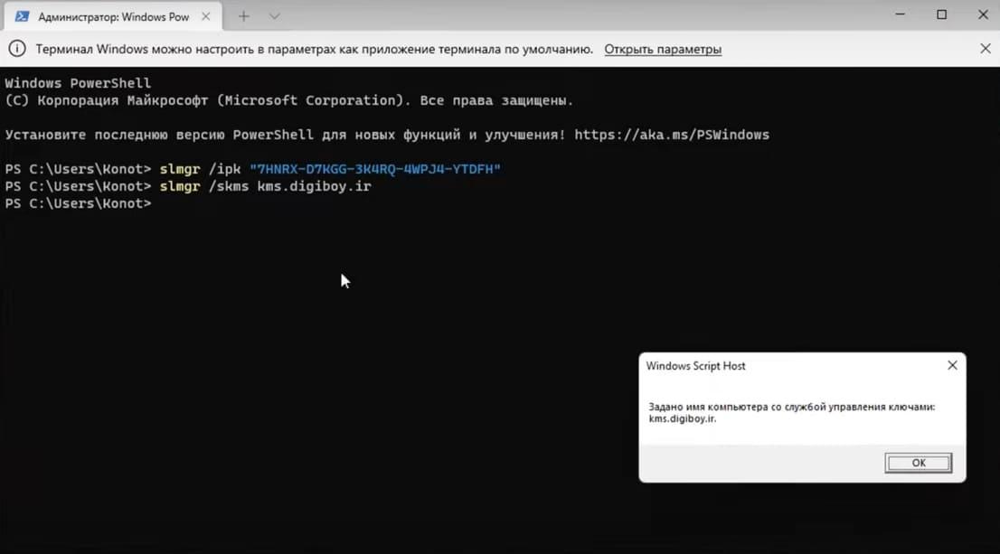

## Активация Windows 11/10 через командную строку

1. Запускаете командную строку или **PowerShell** от имени администратора и выбираете (копируете) нужный ключ для своей редакции:

  - `7HNRX-D7KGG-3K4RQ-4WPJ4-YTDFH` — для Win 10, 11 Home (Домашняя);
  
  - `W269N-WFGWX-YVC9B-4J6C9-T83GX` — для Win 10, 11 Pro (Профессиональная).
  
  - `6TP4R-GNPTD-KYYHQ-7B7DP-J447Y` – для Win 10, 11 Education (для образовательных учреждений)

***Ключи для устаревших версий Windows:***

    - Windows 8.1 Pro: GCRJD-8NW9H-F2CDX-CCM8D-9D6T9

    - Windows 8.1 Корпоративная: MHF9N-XY6XB-WVXMC-BTDCT-MKKG7

    - Windows 7 Pro: FJ82H-XT6CR-J8D7P-XQJJ2-GPDD4

    - Windows 7 Корпоративная: 33PXH-7Y6KF-2VJC9-XBBR8-HVTHH

2. Выполните команду:

    `slmgr /ipk "ваш ключ"`

Например (для Домашней редакции Win 10 и 11):

    slmgr /ipk ”7HNRX-D7KGG-3K4RQ-4WPJ4-YTDFH”

3. Вводите команду:

    `slmgr /skms kms.digiboy.ir`

4. Успешно активируете Windows командой:

    `slmgr /ato`

***Слетит ли такая активация со временем? - KMS-активация рассчитана на полгода, затем просто повторите эту процедуру.***

***Источник: https://windows64.net/450-kyes-windows-11-10.html***