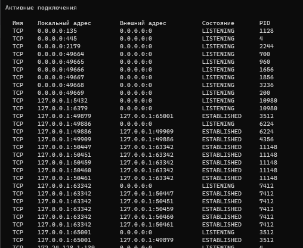

## Посмотреть какие порты открыты

```commandline
netstat -ano
```



## Узнать открыт ли порт

```commandline
telnet 127.0.0.1 5432
```

- 127.0.0.1 - хост (IP-адрес)
- 5432 - интересующий нас порт

Если порт открыт, отобразиться пустая консоль с курсором.

_Если функционал Telnet не доступен, необходимо поставить галочку на ***Telnet Client*** в ***Включить или выключить функции Windows***_
